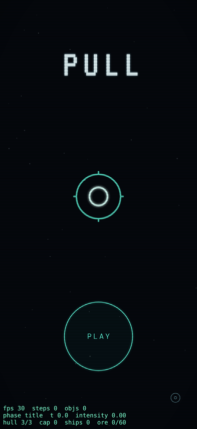
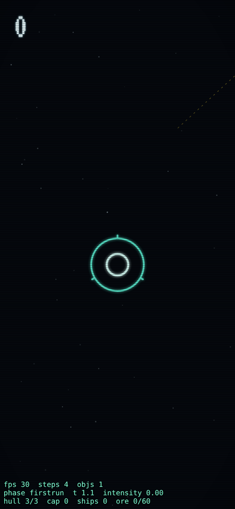
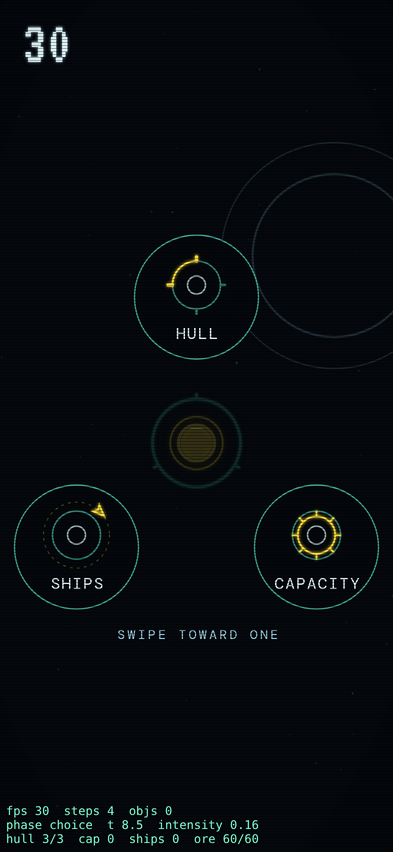
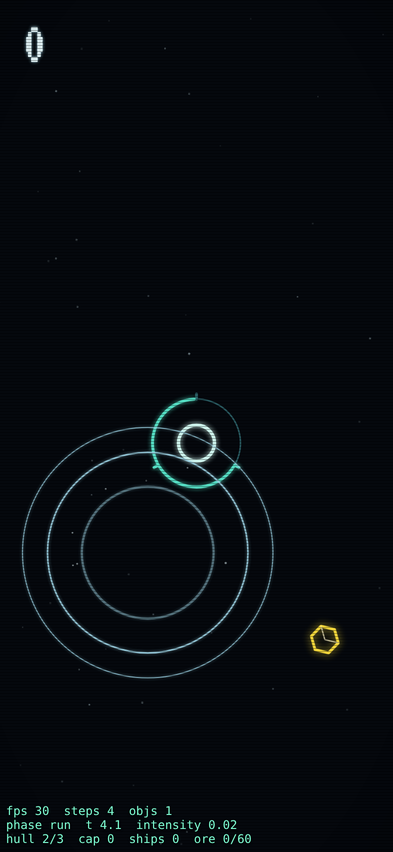
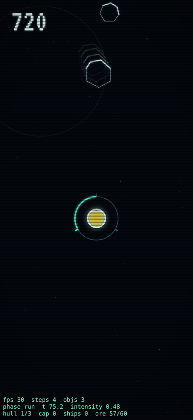
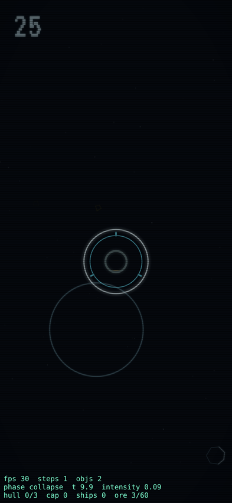
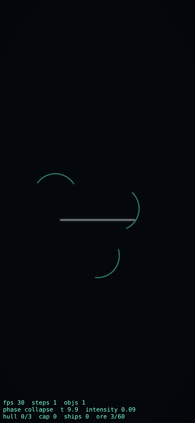

# PULL — Improvement Report

**Subject:** `prototype/phosphor.html` as live at koramak.github.io/pull/prototype/phosphor.html (identical to `pull.html` in this repo)
**Date:** 2026-07-31
**Status:** Recommendations only — no game code has been touched. Each recommendation has an ID (F1, M3, …) so you can approve/reject them individually.

---

## How this report was made

Three inputs went into it:

1. **Research.** Six parallel deep-research passes over the last ~10 years of mobile-game design knowledge, biased to recent smash hits: game-feel/juice craft (Swink, Vlambeer, GDC parameter talks), the psychology of fun (Self-Determination Theory, flow, near-miss research, Sid Meier's player-psychology keynote), case studies of recent hits (Suika, Vampire Survivors, Balatro, Wordle, Royal Match, Monopoly GO, Block Blast, Brawl Stars' revival, Crossy Road/Alto lineage), failure postmortems (Supercell's killed games, Squad Busters, Apex Mobile, the hyper-casual collapse, retention benchmarks), mobile sound + haptics (mute-rate data, pitch-ladder design, phone-speaker physics, iOS/Android haptic APIs), and score-chaser/web-arcade design (restart latency, goal gradient, missions, daily seeds, share artifacts, PWA constraints). ~120 sources; the important ones are cited inline and listed at the end.
2. **Code read.** Full read of the phosphor build (the compiled bundle in `phosphor.html`), the older TypeScript app in `app/src`, both design briefs, and the original `prototype/pull.html`.
3. **Instrumented playtests.** The live build run in a mobile-emulated browser (393×852, touch) with scripted players: a fresh-install tutorial run, a "greedy" player who holds constantly, and a competent reactive player — plus screenshots of every state and measured timings (death-to-retry, tutorial length, hull-loss rates).

**The headline:** the core verb is genuinely excellent and already well-built. One input that simultaneously helps and endangers you ("every save drags danger closer") is the exact pattern behind Downwell's gunboots, Archero's stop-to-shoot, and Suika's every-drop-destabilizes — the research says this is the single deepest asset a one-thumb game can have. The phosphor build's feel floor (fixed 120 Hz sim, hit-stop, shake, a designed death, a taught first run) is already above most prototypes. What's missing is concentrated in three places: **(1) the moment-to-moment feedback isn't yet extracting the drama the sim already generates, (2) the scoring/loop doesn't price risk or skill, and (3) there is almost no reason to come back tomorrow** — which a decade of failures says is what actually kills arcade games (best-score-only meta is the most-falsified design in the genre).

---

## The game today — inventory (from the code and playtests)

What the phosphor build already contains, because several systems are further along than the briefs suggest:

- **States:** title → first-run tutorial (bank an ore with a trajectory guide → deflect a monolith → forced first upgrade choice) → run → choice → collapse (a ~2.75 s designed CRT power-off death) → result → auto-return to title. Auto-pause + resume of a saved run on tab switch. Settings: sound / haptics / reduce-motion / reset-best.
- **Objects:** ore (+25), medium rocks (hp 2 → 2 shards), monoliths (hp 4 → 2 mediums), rubble (crumbles on soft contact), shards, chips. Smash at closing speed >180 px/s (+10 both-rocks; "ORE LOST" if ore involved). +5 deflect credit for well-influenced rocks leaving the screen.
- **The reservoir/choice loop:** each bank adds 5 units toward a 60-unit reservoir; when full, banks pay **double**, a hull hit **spills 25%**, and lifting your finger opens a 3-plate upgrade choice (HULL section / orbiting SHIPS / CAPACITY). Max 6 sections, 3 ships, 3 capacity. All-maxed = permanent double banks.
- **A near-miss system already exists** (gap < 64 px at approach > 120 px/s → flare arc + "NN PX" label + chirp).
- **Difficulty:** keyframed curve, spawn interval 1.7 s → 0.75 s (at 90 s) → 0.55 s (at 210 s), speed +0→80, monolith share 10%→30%. Monotonic; nothing new after 210 s.
- **Feel already in:** 42 ms hit-stop on smashes and hull hits; screen shake (severity-scaled on hull hits); CRT flicker + horizontal tear on hull damage; float texts; double shock rings; ore-chip spill; well rings + in-falling dust; "phosphor echo" ghost images near the finger; an intensity system that ramps bloom/scanlines/vignette with pressure; parallax starfield; reduce-motion support.
- **Audio:** WebAudio synth (no samples), per-event sounds, suspend on pause. Fixed pitches. No music/ambient bed.
- **Haptics:** `navigator.vibrate` patterns on 7 events (= Android-web only; **iPhone Safari ignores it entirely**), with a settings toggle.
- **Persistence:** best score, last-5 runs (stored but never displayed), settings, tutorial-seen, saved run. A seedable RNG class exists but isn't wired up (the daily-mode seam).

Measured in playtests:

| Measurement | Value |
|---|---|
| Tutorial length (competent player) | ~10–12 s, ends with a free upgrade — good early reward |
| "Greedy" player (holds constantly near station) | **dead at 9.9 s game time**. Constant pulling is lethal |
| Competent reactive player, full run | died at **94.6 s**, score 1030 (21 banks, 31 smashes). Hull → 2 at t=14, → 1 at t=40: **the final 54 s were spent at 1 hull with no special treatment from the game**. First upgrade choice arrived at t=77 |
| Intensity system at 1 hull + near-full reservoir | reads **0.48 of 1.0** — hull state isn't an input to the intensity/atmosphere system at all |
| Death → able to act again | **~4.3 s minimum** (2.75 s collapse + 1.5 s result gate), taps during it are swallowed, then PLAY AGAIN must be hit precisely |
| Hull-hit flicker at 3 sections | field alpha dips to 6% for ~0.16 s — a near-blackout during the most dangerous moment |
| Console errors | none (one favicon 404) |

Two latent seams in the code worth knowing about: `hullCritical` is computed every hull hit but never used (a planned last-hull state that was never built), and the last-5-runs history is written to storage but never shown.

### Playtest stills (in `report-assets/`)

| | |
|---|---|
|  **01 — Title.** Confident identity; static — nothing demonstrates the verb (see L5). |  **02 — Tutorial beat 1.** Ore entering top-right with dashed trajectory guide; no upfront verb hint (see X1). |
|  **03 — Upgrade choice.** Great icon language; gold-charged core; the freeze-and-pick moment already sings. |  **04 — Early run.** Well rings around the finger; note the ore (gold hex) has no trail — motion is unreadable in stills (see L1). |
|  **05 — At 1 hull, reservoir 57/60.** The finger-local echo ghosts on the monolith (top) show how good full trails would look. Nothing else signals crisis: intensity reads 0.48 (see M5). |  **06 — Collapse.** The CRT power-off death sequence — arcs flying apart, white beam. Already the game's best-designed moment. |
|  **07 — Result.** Clean, but information-flat: no cause of death, no delta-to-best, no medal, no share (see P4/P5). | |

---

# Recommendations

Categories: your four, plus three the research forced: **FIRST MINUTE** (the failure data says D1 is decided there), **SOUND & HAPTICS** (split from FEEL because the web/native platform constraints are their own problem), and **CODE HEALTH & PORT READINESS** (your secondary question). Every item: **what → why (evidence) → how (concrete)**. Priorities: ★★★ = do first, highest leverage; ★★ = high value; ★ = valuable, later.

---

## 1. FEEL

The build responds on the next frame and has hit-stop and shake — the floor is good. But the research bar for touch is brutal: on a touchscreen the finger sits *on* the evidence, so players perceive spatial error down to ~25 ms of lag (Microsoft Research/CHI touch-latency studies), and feel is built from many redundant, cheap amplifiers stacked per event (Vlambeer's screenshake checklist; *Juice it or lose it*). The sim generates real drama — slingshots, hairline saves, chain smashes — that the presentation currently underplays.

**F1. ★★★ Give the well an attack/release envelope — and release forgiveness.**
Right now well force is a binary on/off. A force that *grabs* feels physical; a toggle feels digital (Swink's real-time-control principle). Ramp strength in over ~60–90 ms with ease-out, and decay over ~120 ms after release. Critically, the decay doubles as **forgiveness**: Celeste ships ~100 ms grace windows on every input because players perceive intent, not timing — a micro-slip of the thumb mid-slingshot currently drops the whole curve. Keep the ramp under 100 ms so it still reads as instant.

**F2. ★★★ Procedural squash & stretch on objects.**
Rocks and ore are rigid outlines that only rotate. Derive deformation from the sim (GDC: Rosen's procedural animation; Disney's oldest principle): stretch along velocity when whipping through the well (`scaleAlong = 1 + k·speed`, squeeze the other axis to conserve area), squash on impact ~80–100 ms, elastic return ~200 ms with overshoot. This is the single change that makes *gravity itself visible* — players see force as deformation. It's also most of Suika's famous charm. Ore deserves a tiny idle shimmer/wobble so the eye finds it (it's the reward; it should feel alive).

**F3. ★★★ Tier the hit-stop.**
One 42 ms value serves every event. Fighting-game and Vlambeer practice scales freeze with meaning (20–50 ms small, 80–150 ms big, 250 ms+ climactic): smash +10 → 40–60 ms; ore bank → ~30 ms plus a station "gulp" squash; hull hit → **100–140 ms** (it's currently the same as an ordinary smash — your worst event should stop the world); death → ~300 ms full stop before the collapse sequence begins. Touch caveat from the research: freeze the *world*, not the finger — keep sampling the pointer and keep the well ring live during hit-stop, or direct manipulation breaks.

**F4. ★★ Trauma-based, noise-driven, slightly rotational screen shake.**
Current shake is a per-frame random offset with linear decay. The GDC-standard recipe (Eiserloh, *Juicing Your Cameras*): accumulate `trauma` 0–1 per event, shake amplitude = trauma², drive offsets with smooth noise (coherent frame-to-frame, reads as camera motion rather than glitch), add up to ~0.05 rad of roll — rotation sells impact on a phone-sized screen at tiny angles — and cap at 1.0 so overlapping hits compound honestly. Trauma budget: bank 0.1, smash-near-station 0.2, hull hit 0.5.

**F5. ★★ Slingshot/near-miss slow-mo — spend time as a feel currency.**
The near-miss system fires a flare but the world doesn't react. On a detected near-miss (and on the last-hull save, see M6): ~200 ms at 0.85× time, or a 60–100 ms hit-stop, plus the whoosh (S-table). This manufactures the "barely saved it" stories players retell — the honest, skill-earned version of the slot-machine near-miss effect (near-misses activate reward circuitry nearly like wins; in a skill game they're truthful information: *you were close, and you control the outcome*).

**F6. ★★ Score theater — bank like Balatro.**
Score currently jumps via raw text. Balatro demonstrated how much juice was left on the table in score presentation: roll the counter instead of jumping it, fly a "+25" chip from the bank point to the score with ease-out (~250 ms), pulse the counter, and scale the counter's excitement with streaks (glow → shake → flame-equivalent in phosphor language). "Presentation can turn a number into a moment" — PULL's physics *earns* these moments and then prints a static number.

**F7. ★★ Permanence — let the screen remember the run.**
Vlambeer's checklist item players feel most and notice least: debris persists. Let shatter fragments tumble and fade over 2–3 s, leave faint scorch marks on hull sections that took hits, and let big smashes leave brief phosphor burn spots. The CRT fantasy is *made* for this — a phosphor screen literally remembers. Cheap on canvas; caps keep it bounded.

**F8. ★★ Fix the hull-hit blackout (juice that blinds).**
At 3 sections the flicker dims the field to 6% alpha for ~0.16 s — a near-blackout exactly when the player must track every rock, and often right before a second (unattributable) hit. The research is unambiguous: juice must never mask threat information (CHI PLAY "juicy design" studies found juicy versions *rated* higher but *played* worse; Kotaku's "red screen of almost-death" critique — never blind the clutch). Keep the tear and the shake; floor the dips at ~40–50% and shorten to ~0.1 s. The drama should come from the designed *sequence*, not from hiding the game.

**F9. ★ Station personality.**
The station is the thing you protect and it never reacts. A flinch on hull hit, a small "gulp" squash when banking, core brightening as the reservoir fills (exists) plus an anxious flicker at 1 section. Charm objects carry screenshots and clips (Suika's faces, Crossy's chickens); one reactive object is enough — don't put faces on rocks (the brief is right), put *behavior* on the station.

**F10. ★ Input plumbing for the wrap.**
Before Capacitor: `getCoalescedEvents()` so the well tracks the true 120–240 Hz finger path, `desynchronized: true` canvas hint (Android win, Safari no-ops), and keep processing the latest pointer inside the same rAF tick that renders. Also treat a <50 ms tap as a deliberate gravity *pulse*, not a no-op — it opens a whole expert technique (tap-tap-tap flicking) for free.

---

## 2. SOUND & HAPTICS

Platform reality first, because it reframes everything: **a web-distributed PULL has zero haptics on iPhone** — `navigator.vibrate` has never existed in iOS Safari (the checkbox hack was patched out). Android Chrome gets crude on/off buzzes. Real haptics (Core Haptics transients with intensity/sharpness) arrive only with the Capacitor wrap — that's the moment iPhone players first *feel* PULL, and it's a genuine launch feature. Meanwhile, audio: a large fraction of mobile sessions are silent (surveys range 27%–91% muted; Merge Mansion's studio budgets for 25–40% sound-on), so sound must amplify, never carry, information. And phone speakers are physics-limited: **nothing below ~150–200 Hz is audible** — several of PULL's current sounds live largely below that line.

**S1. ★★★ Re-voice the low-end events for the speaker they'll play on.**
The hull hit is a 130–170 Hz sawtooth; the collapse tail is a 90→40 Hz sine. On a phone speaker these mostly vanish — your two most important sounds are the two least audible. Keep menace via envelope, not sub-bass: hard attack, longer decay, energy centered ~250–700 Hz, high-pass ~150 Hz, and duck all other audio −6 to −10 dB for ~250 ms on hull hits (the mix gap *is* the impact). Test on an actual phone speaker, not headphones.

**S2. ★★★ Pitch ladders for streaks.**
Every bank plays the same 760+1140 Hz chime forever; smashes likewise. The canonical streak encoder (Peggle's ascending scales; Balatro's rising per-card notes; *Juice it or lose it*): consecutive banks without a hull hit step up a **pentatonic** ladder (pentatonic = overlapping chimes always stack harmoniously); reset on hull hit or ~5 s without banking. Same for smash chains within a combo window. And pitch-randomize every repeated SFX ±2–6% — identical samples become inaudible to the brain within minutes (habituation).

**S3. ★★ An ambient bed that doubles as a game-state channel.**
Silence between events is a missed layer and the CRT fantasy gifts you the answer: a quiet **phosphor hum** (filtered noise + low triangle) that (a) confirms sound is on, (b) rises subtly in brightness/pitch with the intensity system you already have, and (c) drops to a filtered heartbeat-ish pulse at 1 hull (see M6). Alto's Odyssey is the model for ambient audio designed not to loop audibly over endless runs.

**S4. ★★ Event budget and voice discipline.**
Deflect (+5) is the most frequent, least important event — make it near-subliminal and drop it entirely when >~4 sounds are in flight. When a smash and a bank land the same frame, play the bank only. Reserve the *only* long sounds for new-best and death so the big moments stay big (Candy Crush's audio hierarchy: frequent = tiny, rare = ceremony).

**S5. ★★ Audio hygiene for the web.**
Resume the AudioContext on `touchend` (most reliable unlock on iOS), re-resume on `visibilitychange`, schedule on `AudioContext.currentTime` (never `setTimeout`), pre-warm with a 1-sample silent buffer on first gesture. Decide deliberately about the iOS silent-switch: WebAudio is muted by the ringer switch unless you use the unmute-style trick (play a silent `<audio>` element to promote the page to the media channel). Recommendation: yes for a game, with the in-game sound toggle as the escape hatch.

**S6. ★★★ (At wrap time) Real haptic design, not buzz.**
Map events to Core Haptics/`@capacitor/haptics` from day one of the native build: bank = light impact (every 5th = success notification), smash = medium/rigid, hull hit = heavy 100 ms thud, near-miss = sharp light tick (currently has *no* haptic — it's the most feel-worthy event in the game), death = error notification + falling continuous 300 ms, choice lock = selection tick. Rules from Apple/Android guidance and perception research: no continuous buzz during the held well (battery + fatigue + "if it's buzzy, ship nothing"); instead a featherweight tick as each object *enters* the well's grip — event-driven texture. Min ~80–100 ms between transients; coincident events collapse into the strongest; haptic fires in the same frame as audio/visual (if anything slips, let the haptic be late — audio-led binding tolerates ~50 ms+, haptic-led almost none).

**S7. ★ Keep the synth.**
The WebAudio synthesizer is the right instrument for this aesthetic — don't move to samples. The sfxr vocabulary (square/saw zaps, triangle up-chirps for pickups, filtered noise for impacts, 5–15 ms attacks) covers everything in the event table and weighs zero bytes.

---

## 3. MECHANICS & LOOP

The tension engine is real: pulling is dangerous, reservoir-full doubles banks but risks a 25% spill, the choice only opens when you *let go*. The problems: the game doesn't **price risk into score**, the best tension (full-reservoir push-your-luck) is **invisible**, one upgrade is a **trap**, and the ramp is a **featureless slope**. Sid Meier's law from the psychology research: *decisions players don't perceive don't exist.*

**M1. ★★★ Score should pay for style and risk, not just outcomes.**
Currently: bank 25, smash 10, deflect 5, flat forever. Elite play pays the same as timid play — the research on skill-expression (Downwell's combos, Tony Hawk's bank-then-land, Luftrausers' decaying multiplier) says the high-score action and the safe action must be different actions:
- **Chain smashes:** smashes within ~1.5 s: 10 → 20 → 40 … (cap ~4 steps). One well-timed pull that cracks three rocks together should be the best-paying moment in the game — it's already the most spectacular.
- **Proximity bonus:** deflections and smashes that happen *inside* a "danger ring" (say, within 120 px of the hull) pay +50–100%. Holding threats close before flinging them becomes voluntary greed.
- **Near-miss pays:** the existing near-miss event should award a styled "+5 CLOSE" — it's already detected; it's currently emotionally load-bearing but score-inert.

**M2. ★★★ Make the push-your-luck legible.**
The reservoir-full state (double banks vs. spill risk vs. "lift to choose") is the game's most interesting decision and nothing announces it. When full: core pulses gold (exists), add a "×2" tag on every bank float (exists as doubled value — make it read "×2"), a one-time "RESERVOIR FULL — BANKS ×2 — RELEASE TO UPGRADE" line the first two times, and show spilled units as a visible "−15" gold counter when hit. The wager must be perceptible to be a wager (Meier; push-your-luck literature: escalating reward vs. escalating bust risk, where banking must feel *smart*).

**M3. ★★★ Reshape the ramp into named waves with breathers.**
The 1.7→0.55 s monotonic ramp produces correct pressure and an illegible run: no chapters, no exhale, nothing after 210 s. Endless-game craft (Tetris levels; endless-runner lull guidance; flow-channel research) says: ~15 s waves, each ending in a 2–3 s spawn lull with a quiet "WAVE 6" stamp; escalation continues past 210 s on a slower curve (heavier monolith mix, occasional twin-spawn events) so expert runs end in crescendo, not plateau. Waves also create the memory structure ("died on Wave 9, best Wave 10") that fuels retry — Vampire Survivors' entire ending is an engineered "you almost reached it."
*Cheap adjacent fix while you're in there:* run-end telemetry. Log death timestamps (even just locally at first). A pile-up of deaths at one time value is a churn wall (the "First Wall" pattern from the failure research — players who quit angry don't start another session).

**M4. ★★★ Fix the capacity trap.**
Current math: CAPACITY raises the reservoir cap ×1.5 — which makes the next choice *slower to reach* and makes *full* (the ×2 state) harder to maintain, while spills lose 25% of a larger tank. It's anti-synergistic with everything — a trap pick that will quietly teach players choices don't matter. Options (pick one):
(a) capacity also raises the **double multiplier** (×2 → ×2.5 → ×3);
(b) capacity adds **spill protection** (spill 25% → 15% → 8%);
(c) capacity adds a small **passive score trickle** while the reservoir is above half.
(a) is cleanest: it turns capacity into the explicit greed track (bigger, riskier doubles) vs. hull (safety) vs. ships (automation) — three legible identities.

**M5. ★★ The last hull point is a state, not a number.**
`hullCritical` is already computed and unused, and the playtest proved the gap: a representative run spent its **final 54 seconds at 1 hull while the intensity system read 0.48** — hull isn't even an input to the atmosphere formula (it weighs rock count 60% + reservoir fill 40%). At 1 section: feed hull into intensity, cool the palette slightly, drop the ambient to the filtered heartbeat layer (S3), spark the station, and grant a 300 ms "SAVED" slow-mo beat on a successful near-miss deflection. No red vignette, no darkening — never blind the clutch (F8). This single state converts the dread-slog of the research's loss-aversion math (a −1 hull hurts ~2× what +25 pleases) into the game's best drama.

**M6. ★★ A comeback arc — hull restoration at real cost.**
With no recovery, the last minute of most runs is pure dread and every mid-run is a one-way ratchet. Give the HULL choice-plate a second mode: when damaged, the hull pick **repairs the dead section** instead of adding a new one (or: banking 10 ore while at 1 hull relights one section). Loss aversion becomes decision material ("do I spend this choice on repair or greed?"), and "clutch recovery" runs become the stories players tell. Keep it expensive — Meier's stream-of-small-wins, not free lives.

**M7. ★★ Weight the verbs by teaching release, not just hold.**
The greedy playtest bot — hold constantly, like the tutorial teaches — died in 9.9 seconds. The skill is *pulsing*: short pulls, let go, reposition. Nothing teaches this. Add tutorial beat 2.5 (a rock you must *release* to avoid dragging into the station) and/or an early mission ("deflect 5 rocks with pulls shorter than half a second"). This is the difficulty cliff between tutorial and run — exactly the unattributable-death pattern the failure research flags as silent churn.

**M8. ★ Input randomness only — and a visible "rich field" event.**
The spawner is already input-random (good: fairness research says randomize the problem, never the answer). Add an announced variance spike: occasionally a telegraphed **ore surge** ("VEIN INBOUND" + edge shimmer, then 5 ore in 10 s). Anticipation is the dopamine phase (reward-prediction-error: telegraphed rewards beat surprise payouts); it also gives weak runs an ego-protecting story ("bad field"), which pure-skill games lack.

**M9. ★ Ships: keep them scarce.**
Auto-firing ships are automation in a game about agency — at 3 ships the field gets quietly passive. They're well-implemented (collision-course prediction, they die with their section); just keep reload ≥2 s and range modest as you tune, and consider capping at 2 if late-game runs start feeling watched-not-played. Mario Kart Tour's lesson from the failure research: assists that cheapen the core verb hollow the game.

---

## 4. PROGRESSION

The heavy finding. Arcade/score-chasers have the best D1 and the worst D7 of any genre (GameAnalytics benchmarks; arcade drops ~43% D1→D7). Hyper-casual's collapse proved instant fun without a return-reason isn't a game people keep; the survivors all bolted a light meta onto the arcade core (Voodoo's current bar: D1 45% / D7 15% / D30 10%). Crossy Road (collection), Alto (rotating goals), Vampire Survivors (every run unlocks something), Wordle (daily + streak + share) are four proven, *non-cynical* shapes — and PULL currently has none of them: best score is the entire meta. Everything below is buildable without a server.

**P1. ★★★ Three rotating missions (the Jetpack Joyride pattern, still the cited template).**
Exactly 3 concurrent missions from a pool keyed to PULL's verbs: "smash 12 rocks in one run," "bank 3 ore in 10 s," "deflect 20 without a smash," "survive Wave 5 untouched," "get 3 near-misses in one run," "bank while at 1 hull." Stars accumulate toward ranks. The killer property: **a bad-score run still progresses something** — failed runs stop being wasted, which reframes death itself (Koster: the fun is the learning; missions are the curriculum). They also teach advanced technique by assignment.

**P2. ★★★ The daily seeded run + a text share artifact.**
The seeded-RNG seam already exists in the code — wire it up. One UTC-dated seed, identical spawn script worldwide ("PULL #214"), one scored attempt + unlimited unscored practice (Binding of Isaac's forgiving policy), optional daily modifier ("2 hull today," "double ore"). Then the share object, which for a **link-distributed web game is the entire acquisition strategy** (Wordle's grid; slither.io's share-for-skins; browser Suika): one tap copies a spoiler-free text block — `PULL #214 · 4,820 · W9` plus a wave-shape emoji line (one square per wave survived, a red mark per hull lost). Legible in a group chat, braggable, carries the URL. Streak counter with one weekly repair token (Duolingo's forgiveness data: streak-insurance *increases* streak power and cut churn 21% for at-risk users).
*(P1 and P2 are the two highest-leverage retention systems in this entire report.)*

**P3. ★★ Cosmetic collection, never power.**
Ore banked across all runs becomes a wallet; spend it Crossy-Road-style on **station skins, well/trail styles, phosphor palettes** (amber terminal, blue Tektronix, white P4…). Secret unlocks from in-world feats ("smash two monoliths simultaneously → OBSIDIAN theme") generate discovery content. Strictly cosmetic — score integrity is the product in a PB game (Crossy's "money never touches gameplay" doctrine). Palettes double as the cheapest possible content: one config object each.

**P4. ★★ Put the personal best *inside* the run.**
Goal-gradient research: effort spikes as a visible target nears. Show "BEST 4820" small under the score; when the live score crosses ~85% of PB, brighten the counter/ambient (the game itself leans in). On death near PB, say it: **"92% of your best."** That framing at the peak-end moment is the strongest single retry lever the research found.

**P5. ★★ A designed death screen (peak-end rule).**
The collapse sequence is gorgeous; the *information* after it is flat (score + 3 stats). The death screen is the most-seen designed artifact in the game (peak-end: sessions are remembered by peak and end). Add: (a) **cause of death** — one line, "monolith from the left" (deaths must be attributable or they read as cheap); (b) delta to best (P4); (c) one signature stat ("best chain ×4," "3 near-misses"); (d) mission progress ticks (P1); (e) medal vs. your medal thresholds (bronze ≈ your median, gold ≈ your top-10% — computed locally from the run history *you already store and never show*).
And **let a tap skip the collapse into instant restart** (first death keeps the full sequence; after that, tap-through). Measured today: ~4.3 s locked. The Meat Boy/Flappy doctrine — the penalty is the time to restart; take it toward zero — conflicts with the designed death *unless* skipping is allowed. Both, via tap-through, is the answer.

**P6. ★ Lifetime stats page.**
Rocks smashed, ore banked, deflections, near-misses, best wave, total runs. Cheap (the event bus already emits everything), a real investment surface, and the trigger layer for P3's secret unlocks.

**P7. ★ Add-to-home-screen at the earned moment.**
Web-specific: iOS Safari can silently erase localStorage after ~7 days of disuse (ITP) — a lapsed player can return to find their best score gone; home-screen-installed apps are exempt, and PWA install measurably lifts retention (~+18% per CrazyGames). Prompt A2HS once, **right after a new best** — "keep your score safe" — never at first load. Mirror the PB into the share code as belt-and-braces.

---

## 5. LOOK

The phosphor identity is strong, confident, and ownable — the collapse sequence and choice plates are already screenshot-worthy. The gaps are all *information design*, and the design brief itself names the standard: threat vs. reward "must survive peripheral vision, motion blur, and a thumb covering 15% of the screen," and trajectories are "the primary game information." Squad Busters died of readability; Royal Match won on it.

**L1. ★★★ Trails. The brief promised them; the build doesn't have them.**
The phosphor-echo ghosts only render within 190 px of the *active finger* — objects elsewhere have no motion history, so trajectory reading (and the brief's "screenshot your best save" goal) doesn't exist yet. Give every object a short tapered phosphor-decay trail (the ring-buffer history is already stored per object — 20 points; it's rendered only as near-finger echoes). Ore gets a warmer, slightly longer trail. This is simultaneously the biggest readability fix, the biggest beauty fix, and it *is* the brand: a phosphor screen remembering motion. Keep the finger-local echo effect on top — it's lovely.

**L2. ★★★ Spawn telegraphs at the edges.**
Objects currently pop into existence at screen edges aimed at the station — at late-game speeds, with a thumb covering the lower field, that's an unattributable-death machine (the single most expensive kind of death per the failure research; also the Meier fairness rule). 0.4–0.6 s before each spawn: a small phosphor blip/arrowhead at the entry point — cyan for rock, gold for ore, larger for monoliths. This also *creates* anticipation (reward-prediction) for incoming ore. Fade the warning as the ramp matures if you want late-game to stay scary — but never for monoliths.

**L3. ★★ Separate the station's color from the rocks'.**
Rocks are pale cyan (#9fd6e8), station teal (#5ef2d6) — same temperature family, exactly what the brief forbids for threat/reward but here it's threat/*protectee*: under motion blur and peripheral vision, rock fragments and station arcs converge. Nudge rocks toward colder ice-blue/steel and keep the station distinctly warmer-green (or vice versa), and check both under the bloom-heavy late-game state. (Ore/gold vs. everything is already excellent, including for color-blind players — hue + shape both differ.)

**L4. ★★ Audit the intensity system's direction: it darkens the game as danger rises.**
At high intensity: scanlines 0.30→0.54 alpha, vignette closes in, stars dim, wobble. Atmospherically perfect; informationally inverted — the screen gets *harder to read* exactly when reading it matters most (the F8/Squad Busters principle again). Keep the direction but rebalance the budget: let bloom and hum carry "things are serious," cap scanline alpha ~0.42, and make the *playfield core* (station ± 200 px) exempt from vignette encroachment.

**L5. ★★ Title screen: show the toy.**
The title is static. Every first-minute case study (Crossy, Suika, hyper-casual's 3-second-comprehension bar) says: demonstrate the verb before the first touch. Run a slow attract-mode behind the title — drifting rocks, a ghost finger pressing down, everything bending toward it. Zero-risk (the sim already runs field-only via `clearField`/cull paths), and the title becomes a living screenshot of the fantasy: *your finger is gravity.*

**L6. ★ Result screen as the shareable artifact.**
Once P2 exists, the result screen should *be* the share card: score, wave shape, medal — composed so a raw screenshot is already braggable (legible at chat-thumbnail size, station burn-in motif behind it). The burn-in ghost you already draw is a beautiful signature; build the card around it.

**L7. ★ Thumb-shadow discipline.**
The well renders under the finger (rings extend beyond it — good), but payoffs sometimes bloom exactly at the touch point. Bias particle bursts outward from the contact point, keep floats spawning above the touch (bank float already offsets −74 px — good), and never place tap targets in the bottom-center dead zone during play. (Choice plates and buttons already respect this.)

---

## 6. FIRST MINUTE (added category)

D1 is decided here: 73% of players never return after day one at industry medians, and the first-session research is blunt — every screen before gameplay is D1 tax, the verb must teach itself, and early deaths the player can't explain are the biggest churn point. PULL's tutorial is genuinely good (show-don't-tell, ends with a free upgrade ~10 s in). The gaps:

**X1. ★★★ Teach the release (see M7).** The tutorial teaches hold-to-bank and hold-to-deflect; it never teaches *letting go*. The natural post-tutorial strategy — hold constantly — kills in ~10 s. One more beat: a rock that must be released, or an explicit "short pulls" hint on the first real run.

**X2. ★★ First-runs mercy.** Rubber-band the first 2–3 lifetime runs gently (spawn interval floor ~1.9 s, no monoliths in the first 30 s, one free "shield" flash on the first would-be hull hit of run 1). Meier's playtest law: players accept one bad beat, not two; a first-session death before any competence signal is the most expensive event in the funnel. Decay mercy silently by run 3.

**X3. ★★ The 30-second test, instrumented.** A first-time player should cause their first satisfying deflection within ~30 s of page load (currently passes if they don't idle — keep it true as you add things). Log tutorial-completion and first-3-runs death times from day one; that funnel is where the game lives or dies.

**X4. ★ Attract mode is onboarding too (L5).** The verb demonstrated before first touch halves the teaching burden.

---

## 7. CODE HEALTH & THE ROAD TO iOS/ANDROID (secondary focus, plain language)

You asked: *when it's time to move to phones, is the code in good shape for that transfer, or is it messy and inefficient?*

**The honest picture: the code quality is genuinely good. The problem is that your best game currently has no source code.**

In plain terms — this project has three copies of PULL:

1. **`prototype/pull.html`** — the original small prototype. Fine; it's the historical baseline.
2. **`app/`** — the "production" version, written in TypeScript (a stricter, safer JavaScript). This is the code a native app would be built from. **It's well-made.** I read all of it: it's organized into small single-purpose modules (simulation / rendering / input / audio / effects / settings), every tuning number lives in one config file exactly as the engineering brief demanded, it uses the professional patterns for smooth consistent gameplay (a fixed-rate simulation so the game behaves identically on a fast iPhone and a cheap Android; object pooling so it never stutters from memory churn), and it already has the seams a native port needs: the haptics file literally says "when wrapped in Capacitor, swap this one function." Capacitor (the wrap-web-code-into-a-real-app tool) is already configured. **For a solo project this architecture is above par, and the native transfer as designed is cheap: the same code ships to web, iOS, and Android.**
3. **`prototype/phosphor.html`** — the version you pointed me at, the best version of the game… and it is a **compiled bundle**: machine-generated, minified code (single letters for names, one giant line). It was imported from a Claude artifact as a finished file. Its human-readable source — the TypeScript that *produced* it — **is not in this repository.** And `app/` is a generation behind it: the app code has no reservoir, no upgrade choices, no ships, no monoliths, no near-miss system, no collapse sequence, no tutorial.

Why this matters in practice: every improvement in this report has to be built somewhere. Editing the minified bundle directly is miserable and error-prone (I could read it for this review, but you don't want anyone *developing* in it), and it breaks your own rule that all tuning lives in one editable config file. So:

**C1. ★★★ Re-establish a single source of truth before any feature work.**
Two options: (a) if the phosphor prototype's source project still exists in the artifact/session that generated it, recover it into this repo; (b) otherwise, port the phosphor systems into `app/` (the clean TypeScript codebase) — a mechanical, well-bounded job since the bundle is readable and `app/` already has the right skeleton. Either way, the rule afterward is: **`app/` is the game**; `prototype/` files are frozen history; the deployed page is built from `app/` by the existing GitHub Action. Do this first — it's the difference between every later change taking an hour vs. a day.

**C2. ★★ Performance: one thing to verify on a real phone.**
The bundle smartly pre-bakes glow into sprites (good), but several elements still draw glow live every frame (score text, station core, well rings, floats). Canvas glow (`shadowBlur`) is the classic mobile-canvas performance trap. My headless tests can't measure real devices. Before deep tuning: open the game on a mid-range Android phone with `?debug` on and watch the fps counter at high object counts. If it dips, the fix is known and easy (pre-bake the remaining glows the same way sprites already are). Everything else — object caps, pooling, the collision grid, DPR cap — is already sensibly bounded.

**C3. ★ Small housekeeping (with the port in mind).**
Dead code: `hullCritical` computed but unused (use it — see M5 — or delete it); last-5-runs saved but never displayed (use in P5 medals). The seeded-RNG class is present but unplumbed (needed for P2). `pull.html` duplicated in the Test repo will drift — prefer linking the Pages URL. None of this blocks anything; it's just the tidy-up that makes the port smoother.

**Bottom line for the transfer:** not messy, not inefficient — the opposite; the architecture was explicitly designed for the phone wrap and it shows. The one real debt is that the current best game exists only as a build artifact. Fix C1 and the path to the stores is: `npm run build` → Capacitor wrap → add real haptics (S6) and app icons (already in `design/icon/`) → store listings. No rewrite anywhere on that path.

---

## Suggested order of attack

If you approve, I'd sequence it like this (each phase is independently shippable):

**Phase 1 — Source of truth + feel core (the "make it sing" pass):**
C1 → F1, F2, F3, F4, F8, S1, S2, M2, X1. *(Well envelope, squash/stretch, tiered hit-stop, honest shake, fix the blackout, speaker-safe sounds, pitch ladders, legible push-your-luck, teach release.)*

**Phase 2 — Loop & fairness:** M1 (risk-priced scoring), M3 (waves + telemetry), M4 (capacity fix), M5 (last-hull state), L1 (trails), L2 (spawn telegraphs), P4/P5 (PB-in-run + death screen + tap-to-skip).

**Phase 3 — The return-reason layer:** P1 (missions), P2 (daily + share), P3 (collection), P6, P7, L5, L6, X2.

**Phase 4 — The wrap:** S6 (real haptics — the iPhone feel unlock), C2 verification, store prep.

A note on scope discipline from the failure research: Phases 1–2 make the game *better*; Phase 3 is what makes it *retain* — the decade's arcade postmortems say don't skip it, and don't judge PULL's future on week-one enthusiasm (Squad Busters' lesson: only returning cohorts are evidence).

---

## Key sources

*Feel & juice:* Swink, **Game Feel** (the ~100 ms law); Nijman (Vlambeer), **The Art of Screenshake** (INDIGO 2013); Jonasson & Purho, **Juice it or lose it** (2012); Eiserloh, **Juicing Your Cameras With Math** (GDC 2016) + **Fast and Funky 1D Nonlinear Transformations** (GDC 2015); Rosen, **An Indie Approach to Procedural Animation** (GDC 2014); Berbece, **Why Your Death Animation Sucks** (GDC EU 2015); Thorson, **Celeste & Forgiveness** (2020); Jota et al., **How Fast is Fast Enough?** (CHI 2013); Hicks et al., **Juicy Game Design** (CHI PLAY 2019); Kao et al. (CHI 2024).
*Psychology:* Ryan/Rigby/Przybylski (SDT/PENS, 2006–2010); Chen, **Flow in Games** (2006); Koster, **A Theory of Fun**; Lazzaro, **4 Keys to Fun** (2004); Schultz, reward-prediction-error (2016); **Near-Miss Effect** review (J. Gambling Studies 2020); Meier, **The Psychology of Game Design** (GDC 2010); Costikyan, **Uncertainty in Games** (2013); Duolingo streak-freeze case data (2023–26).
*Hits:* Deconstructor of Fun (Royal Match 2021; Brawl Stars 2024; Squad Busters 2024), Naavik (Royal Match, Survivor.io, hybrid-casual), Mobilegamer.biz (Monopoly GO's dice-roll iteration; Block Blast A/B culture; Supercell's 8.8× Brawl comeback), Aladdin X/Suika coverage (2023), LocalThunk/Balatro interviews + Crosley's **Balatro: Juicy Feedback** (2024), Wardle/Wordle history (2021–22), Hall & Sum, **Crossy Road: A Whale of a Time** (GDC 2015), Team Alto (2018), Fumoto, **Polishing the Boots** (GDC 2016), McMillen (Super Meat Boy restart doctrine).
*Failures & benchmarks:* Supercell postmortems via Game World Observer/PocketGamer (Clash Mini, Everdale, Boom Beach Frontlines, Squad Busters "we were wrong"); Apex Legends Mobile & Warzone Mobile autopsies (2023–26); Mario Kart Tour & Diablo Immortal monetization backlash; Konvoy/Naavik/Voodoo on the hyper-casual collapse and hybrid-casual bars (D1 45 / D7 15 / D30 10); GameAnalytics benchmark reports (2019, 2025: top-quartile D1 ~27%, median D7 ~3.5%; arcade's −43% D1→D7).
*Sound & haptics:* Metacore, **Hear me out** (mute-rate design); TapResearch (2022); Candy Crush audio breakdown (Game Developer 2014); Audiokinetic, **Peggle Blast peg-hit music system** + smartphone frequency-response measurements; **The Power of Pitch Shifting** (Game Developer); Apple HIG **Playing Haptics** + WWDC 19/21 Core Haptics sessions; Android haptics principles; Capacitor Haptics docs; MDN `navigator.vibrate`; multisensory binding-window literature (JASA 2022); Astro's Playroom haptics deep-dives.
*Score-chasers & web:* Spelunky daily-challenge design; Wordle share-grid history (TechCrunch/Slate 2022); slither.io distribution analyses; Yu-kai Chou on leaderboard failure/percentiles; goal-gradient research (Kivetz); Kotaku, **Enough With The Red Screen of Almost-Death**; WebKit/MDN platform notes (ITP 7-day storage cap, iOS Web Push 16.4+, 120 Hz rAF, `touch-action`/`dvh`/safe-area); CrazyGames PWA retention data.

*(The six full research digests — every claim with its source URL — are committed alongside this report in `report-assets/research/`.)*
